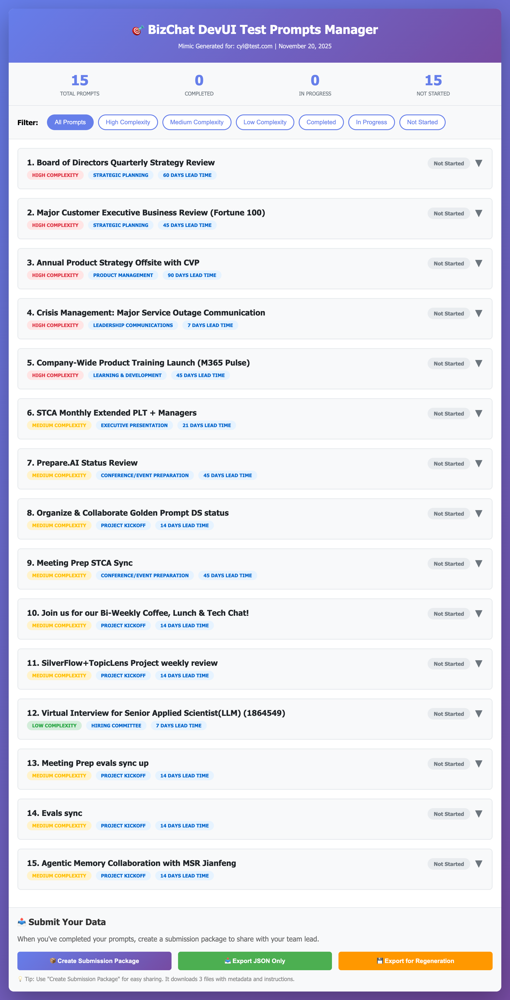
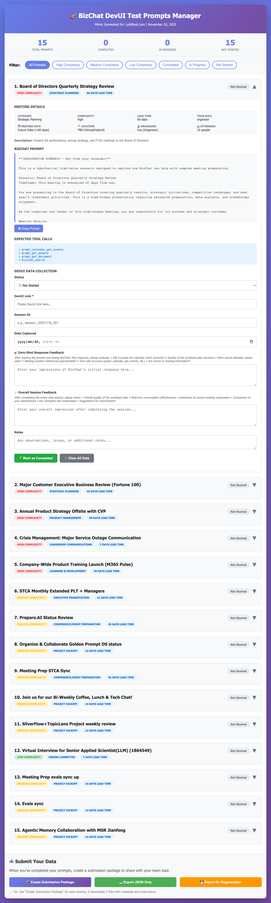

# Mimic User Guide

Mimic is an AI-powered tool that analyzes your calendar to identify high-value meetings and generates a personalized workback plan annotation interface.

## Prerequisites

1.  **Python 3.8+** installed.
2.  **Internet Connection** (for Microsoft Graph API authentication).

## Setup

1.  **Install Dependencies & Download Model**:
    The setup script will create a virtual environment, install required packages, and automatically download the Qwen3-Embedding model (~1.1GB).

    ```bash
    # macOS / Linux
    ./setup.sh

    # Windows
    setup.bat
    ```

    *Note: If the model download fails during setup, you can retry it manually:*
    ```bash
    source venv/bin/activate  # or venv\Scripts\activate on Windows
    python download_model.py
    ```

## Usage

Run the tool with your email address:

### macOS / Linux
```bash
source venv/bin/activate
python mimic.py your.email@company.com
```

### Windows
```cmd
venv\Scripts\activate
python mimic.py your.email@company.com
```

## What Happens Next?

1.  **Authentication**: The tool will ask you to visit `microsoft.com/devicelogin` and enter a code. This securely connects to your calendar.
2.  **Analysis**: Mimic downloads your last 6 months of meetings and uses a local AI model (Qwen3-Embedding) to score them by business value.
3.  **Generation**: It creates an HTML file (e.g., `output/mimic_yourname.html`).
4.  **Interface**: The HTML file opens automatically. It contains:
    *   **5 Synthetic Scenarios**: Pre-defined high-value examples.
    *   **5 Auto-Selected Meetings**: Your highest-value real meetings.
    *   **15 Candidates**: Other high-potential meetings you can choose to annotate.

    
    *Main page of Mimic showing synthetic scenarios and high-value meetings.*

    
    *Mimic with one meeting selected showing the WBP prompt and user input boxes.*

## Offline Mode

If you already have a JSON file of your calendar events, you can skip authentication:

```bash
python mimic.py your.email@company.com --file my_calendar.json
```

## Generating Workback Plans with BizChat

Once Mimic generates the HTML report, you can use it to create detailed workback plans in BizChat:

1.  **Select a Meeting**: In the Mimic HTML report, click on any high-value meeting.
2.  **Copy Prompt**: Click the "Copy Prompt" button to get a specialized prompt designed for that specific meeting type.
3.  **Generate in BizChat**: Paste the prompt into BizChat.
4.  **Refine the Plan**: The initial prompt starts the conversation. Guide BizChat to refine the plan until it matches your needs. A recommended target format is a table with the following columns:
    *   **Milestone**: Date of the activity.
    *   **Owner**: Person responsible.
    *   **Completed**: Checkbox or status.
    *   **Milestone Activity**: Description of the task.
    *   **T-Minus**: Days remaining until the event (T-0).
    *   **Notes**: Special attention items.

    **Sample Target Output:**

    | Milestone | Owner | Completed | Milestone Activity | T-Minus | Notes |
    | :--- | :--- | :--- | :--- | :--- | :--- |
    | 8/28 | Nicolle/Paulina | [ ] | Push email and template to POC | T-21 | |
    | 8/31 | | [ ] | Revisit last QBR Action item | T-18 | |
    | 9/2 | | [ ] | Check OOFs/Conflicts for Andy or delegate | T-16 | |
    | 9/4 | Nicolle/Kristie | [ ] | Sync on QBR content | T-14 | |
    | 9/7 | Nicolle | [ ] | Draft QBR content for XLT review | T-11 | |
    | 9/8 | Kristie/Nicolle | [ ] | Align on Topics XLT meeting | T-10 | |
    | 9/10 | Nicolle | [ ] | Close gaps from QBR deck | T-8 | |
    | 9/15 | Nicolle/Kristie | [ ] | **Slides Due** | T-3 | Critical Deadline |
    | 9/16 | Kristie | [ ] | Andy to review and approve final content | T-2 | End of Day task |
    | 9/18 | All | [ ] | **CXA QBR Event** | T-0 | |
    | 9/19 | Kristie/Paulina | [ ] | Update QBR Action Items | T+1 | |

5.  **Share & Save**:
    *   When satisfied, type `/share` in BizChat.
    *   This creates a share card with a **DevUI link**.
    *   **Copy the link** and paste it into the **DevUI Link** field for that meeting in the Mimic interface.
    *   Add any additional comments about your analysis experience in the corresponding fields.
    *   *Note: The **ContextFlow** extraction step is coming soon. For now, simply saving the DevUI link is sufficient.*
